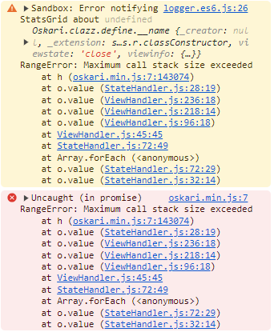
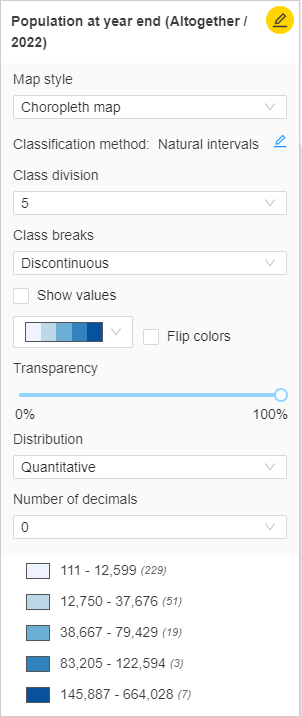
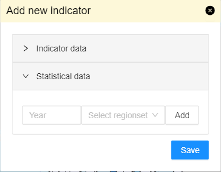
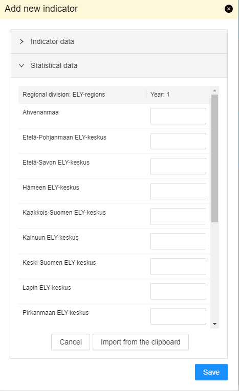
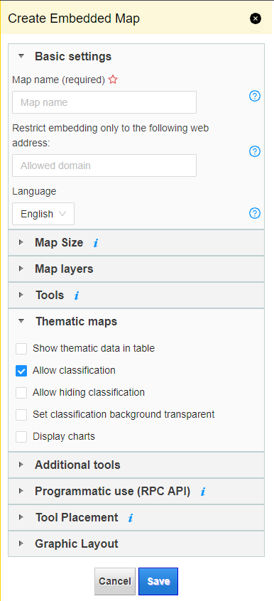

# Testing Oskari and reporting bugs

An article written by Ina Högström (trainee, NLS FI).

I came on board to the National Land Survey’s team in the later stages of Oskari’s development cycle in January 2024. One of the new features that the team worked on was changing the thematic map feature to be done with React instead of jQuery: the whole user interface related to thematic maps was re-written with the new library. First I familiarised myself with [Paikkatietoikkuna](https://kartta.paikkatietoikkuna.fi/) and its demo version.

Most of my testing I did on the demo version of Paikkatietoikkuna, which is updated to the newest version when there is a fix or a new implementation. Mostly my testing was centred around using thematic maps and problems that arise when using them. 

## Thematic maps

Thematic maps allow the user to present statistics on a map. The statistics are fetched from different data sources, e.g. via an API or from data the user has made themselves. The user can present indicators that either already exist or the ones they create. The indicators can be specified for example by year or by regional division. Some indicators have other specific options. Indicators can also be presented in a table or a bar chart. See an example below.

My testing with thematic maps began with searching indicators and seeing if something unexpected happened. During the testing I tried different indicators with different parameters and wrote down whether there was an issue or if it worked as intended. 

The issues could be tracked via an error message in the “Developer tools” console of the web browser. The console can be opened by clicking with the map window the right button of the mouse and selecting “Inspect” from the menu that appears. Usually errors show in an error message - yet some errors don’t even though they appear.

There are two kinds of error messages. Some have a yellow background in the console, the others a red/pink background. The red notifications are almost always critical problems which need to be reported as fast as possible. The yellow notifications are not always as critical but they, too, should be reported. Below is an example of these.

The classifier of thematic maps had to be tested, too. The classifier has many different options on how indicators can be presented on the map and all of them need to work correctly.

“My indicators” (the ones the user can make themselves) were worked on a little longer and became testable later. Their testing didn’t differ from the testing of already existing indicators apart from the fact that they had to be made first.

When creating My indicators, I did the process both correctly and incorrectly in order to find the most amount of errors. This process applied to other testable features, too. 

Sometimes My indicators brought to light some weird cases that didn’t present themselves unless I was using smaller values or areas.  

Another case that I tested was thematic maps in published (embedded) maps. Thematic maps change some things in the map publisher that needed to be tested. These features need to work independently and together with other map publishing features. 

One can view a published map in a separate window through “My Data” or in the map publisher itself. In both cases the thematic maps need to function as expected. 

Sometimes I would test Paikkatietoikkuna with other members of our team. For example, we would review new items that needed testing or revisit previously identified bugs that required further information about their severity. 

## How to file a bug report?

When finding an error the first thing that needs to be done is to try and replicate the error. This ensures that the issue is indeed an error in the service and not, for example, an individual typing mistake.If you have the previously mentioned Developer tools console open in your web browser, copy the error message that appears there.

The issue should have the details of how the Oskari service you used should work or how it’s assumed to work. After that it would be best to tell a little more about the issue. For issues that are more complex, there should be a step-by-step guide on how one can reproduce the problem. That helps the person who fixes the issue to understand it better and how to fix it. The same principle applies to Oskari’s bug reports as to any other software: "document what you did and in what order" - starting from opening the map and adding map layers.

It’s good to attach screenshots to the issue: you can, for example, show the error messages in the console or the error itself on the map or some place else where it appeared.

## Where a bug report is sent?

Bugs and errors related to the data or Paikkatietoikkuna can be reported directly through the feedback page of Paikkatietoikkuna. Messages from Paikkatietoikkuna’s customers are most often routed via its customer service. Similarly, users can report issues they find to the customer service of individual websites using Oskari.  

However, bugs and errors related to Oskari should also be reported on [Oskari’s GitHub page](https://github.com/oskariorg/oskari-documentation/issues/). The page includes instructions on how to file a bug report, or “issue” in GitHub terms. To report a problem, you will need a GitHub account, which requires registration. Without registering, you can still view previously reported issues on GitHub to check whether someone else has already reported the same problem.  

[Oskari’s website](https://oskari.org/contribute) lists various ways to get in touch if the bug concerns Oskari.

From Oskari’s perspective, just as anyone can submit pull requests to Oskari, which are monitored, issues reported on GitHub are also reviewed. These issues are then discussed to determine whether the described matter is a bug or a feature request. For each bug, the team evaluates its criticality and prioritisation - or decides that a specific development task cannot be addressed at the moment. Even in such cases, it’s essential to make requests visible publicly, as others might need the same feature and could contribute to its development. After all, Oskari is the result of collaborative development.  

Oskari’s technical coordinator Sami Mäkinen strongly encourages reporting issues on GitHub:  
*“Reporting any problem to GitHub is very useful because someone else might encounter the same issue, and users can then be directed to read the related discussion in the GitHub issue. Developers working on their own instance of Oskari might also run into a similar issue and find a solution directly in the GitHub issue discussions.”*

If using GitHub feels overwhelming, the simplest option for questions specifically about Oskari is [Gitter](https://app.gitter.im/#/room/#oskariorg_chat:gitter.im), where you can ask for help or comment on issues via chat. Filing an issue on GitHub is the second simplest approach. The third option for Oskari-related matters is [the email list provided by OSGeo](https://lists.osgeo.org/mailman/listinfo/oskari-user).  
