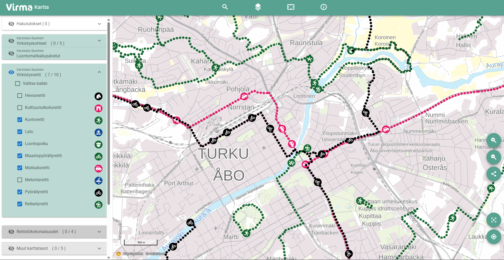

# Why to join Oskari JDF?

Oskari’s Joint Development Forum (JDF) consists of organisations that use Oskari for their map services and have an interest in developing Oskari together. By joining the JDF, organizations can support both the Oskari software and its community. The continuity and maintenance of Oskari depends on its active use and on member contributions, and are supported through communication and other means.

The JDF is formed by several organizational members who pay an annual fee that covers Oskari’s communication, provides technical assistance from NLS FI and ensures the ongoing development of the software. Each year, 1-2 organizations are selected as **community members** who may participate in the JDF free of charge.

This year the community chose Ubigu Ltd. and the city of Joensuu as the new community members. As we welcome the new community members, we give our warmest thanks to Lounaistieto who used to be a community member and was a part of the Oskari community since the very beginning of the JDF. This means a whopping, nearly 20 year-long membership! 

We interviewed Natalia Räikkönen from Lounaistieto and asked about her experience in the community.

The Oskari service of Lounaistieto can be found [here](https://karttapalvelu.lounaistieto.fi/). Virma map service, based on Lounaistieto's Oskari instance, can be found [here](https://kartta.virma.fi/).

## Being a community member of JDF

“Via the JDF group we have gotten development ideas, support and solutions to our problems with our map service. It has also been very valuable to have had the chance to network with other agencies. We have also had some influence on the development trends of Oskari in general.

The membership gave us a chance to see examples of others’ Oskari implementations, get peer support and develop our own service better than before. That meant we could benefit from Oskari in more diverse ways and build map services that are tailored for the agencies in our area.

Networking, sharing information and peer support were significant benefits. In addition, we got to use tested solutions and code, which saved us time and resources when we were developing our services.

In the beginning Lounaistieto used Oskari as a simple map service. As of now, we have done different embedded maps based on the geoportal - this includes the waste disposal map for the website of Lounais-Suomen Jätehuolto Oy (The Waste Disposal Southwest Finland Ltd) and a water protection map for the water protection agencies in the area. The Virma map that uses local recreational information is a web browser based application that is based on Lounaistieto’s Oskari geoportal and implements the RPC technology.

In the future we will continue to use Oskari as a part of local information production and communications. The service will be developed according to needs and Oskari will remain an important part of Lounaistieto’s digital services.

The JDF offers an excellent place to influence, develop and get support for making the most of Oskari. Especially for those who are building a new map service the membership can bring a chance to save time and resources. One can get help and tips easily. As a part of the community one doesn’t need to act alone - one should join in if one wishes to develop map services in a cost-effective way in a competent and open network.”